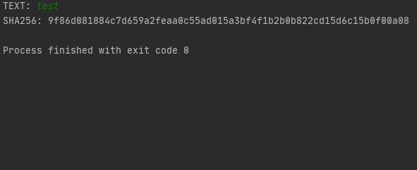

# TOSHA256
A simple application that hashes entered data using the SHA256 method. Run the script, then enter text you want to be hashed, next you will see the result. 
 

# Usage
1. Run the script
2. Input text you want to hash using SHA256 method and click enter
3. You will see the result on the screen

# Author
Filip Rokita 
www.filiprokita.com
